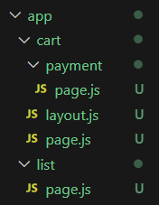

## Next.js를 많이 사용하는 이유?

### Server-Side-Rendering의 재유행

- CSR(Client Side Rendering) : 브라우저에서 실시간으로 html을 생성<br />
  -> 부드러운 사용자 경험 제공
- SSR(Server Side Rendering) : 서버에서 html을 미리 만들어 전송한 것을 브라우저에서 띄움<br />
  -> 페이지 로딩 속도 향상, 검색 시 노출도 증가
  <br />
  <br />

### 💭 Next.js의 렌더링 방식

> **Pre-Rendering**
>
> - SSR
> - SSG
> - ISR

이에 관해 자세한 내용은 따로 작성할 예정 . . .<br />
참고 - https://enjoydev.life/blog/nextjs/1-ssr-ssg-isr#isr-incremental-static-regeneration

  <br />

## Next.js의 캐싱

### 언제 데이터가 캐싱 될까?

- 빌드 시 - `next build`로 Next.js 앱을 빌드한 경우 <br />
- 요청 시 - `next start`로 시작한 Next.js 앱에 브라우저에서 요청이 발생한 경우

<br />
-> 서버 사이드 : SSR이나 SSG 방식에서는 data fetching이 서버 사이드에서 이루어지며,

이를 위해 `getServerSideProps`, `getStaticProps`같은 Next.js의 데이터 패칭 함수를 사용한다. <br />
-> 클라이언트 사이드 : `SWR`, `React Query`같은 도구를 사용하여 사용자의 상호작용에 대한 반응으로 동적으로 데이터를 불러오거나 UI를 업데이트한다.
<br />

### 💭 Next.js의 캐싱 기능과 data fetching을 위한 React 라이브러리

> React에서는 data fetching 최적화를 위해 `SWR`과 `React Query` 등을 사용했었다. 그러나 Next.js 앱 라우터는 전역 fetch 함수에 의해 가져온 데이터를 캐싱하고 재사용할 수 있도록 최적화되어 있다. 그렇다면 Next.js에서 해당 라이브러리들을 사용하는 경우는 왜 그런 것일까?
> <br /><br /> \> Next.js의 캐싱 기능은 주로 서버 사이드에서의 데이터 패칭과 관련된 최적화에 초점을 맞추고 있다. 따라서 SSR과 CSR을 모두 지원하는 Next.js에서 클라이언트 사이드에서의 데이터 패칭, 캐싱, 상태 관리를 보다 효율적으로 처리하기 위해서 React Query같은 도구를 사용하기도 한다.<br />&emsp;ex) 사용자 인터랙션에 의해 트리거되는 API 호출, 데이터 새로고침,무한 스크롤링 등의 경우, React Query를 활용하여 클라이언트 사이드에서의 데이터 관리를 최적화할 수 있다.

<br />

## 라우팅과 layout

### 자동 라우팅

Next.js는 app 폴더 내에 폴더와 파일만 만들어주면 디렉토리 구조를 기반으로 자동으로 라우팅이 된다.
이 때, 폴더명은 url path의 segment가 되고, 파일명은 반드시 page.js로 지어야 함을 알아두자.<br />

### 중첩 라우팅

폴더 안에 폴더를 만들어 감싸주면 중첩 라우팅도 쉽게 해줄 수 있다.

### layout

- layout은 page를 감싸고 있으며, 이 역시 중첩하여 사용이 가능하다.
- 리액트의 Outlet과 유사



<br />

## 이미지 최적화

```javascript
import Image from "next/image";
import tomatoes from "/public/tomatoes.png";
```

```javascript
<Image src={tomatoes} className="food-img" />
```

이미지를 컴포넌트화하여 사용함으로써 최적화 할 수 있다. (lazy loading, 사이즈 최적화, layout shift 방지)

<br />

## client/server component

Next.js에는 client component와 server component가 존재한다.<br />
기본적으로는 server component이고, 파일의 최상단에 `'use client'` 입력 후 그 아래로 작성한 컴포넌트는 client component가 된다.
<br />

### Server Component

- html 코드 부분에 javascript 기능(onClick 이벤트, React Hooks 등) 사용 불가
- 빠른 로딩 속도
  - 자바스크립트 코드 없이 페이지가 정적이게 되므로
  - hydration(html을 사용자에게 보낸 후, js로 다시 읽고 분석하는 일) 필요 x

=> 전체 페이지는 서버 컴포넌트, JS 기능이 필요한 곳에만 클라이언트 컴포넌트 사용하는 식으로 적절히 섞어서 효율성을 높이도록 하자!
