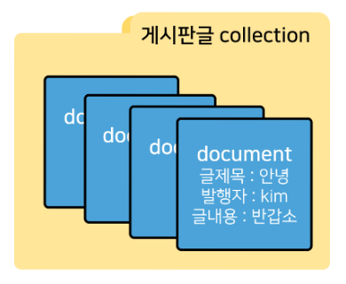
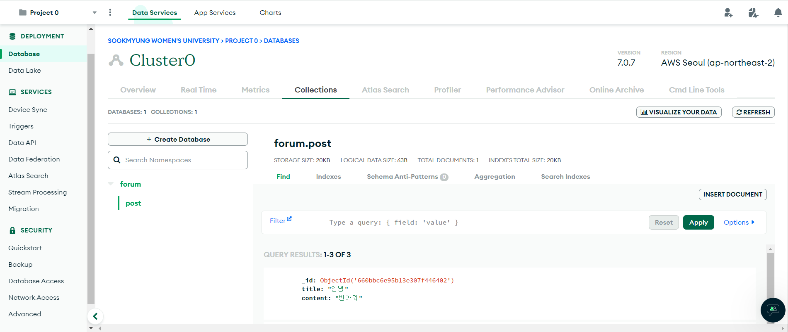
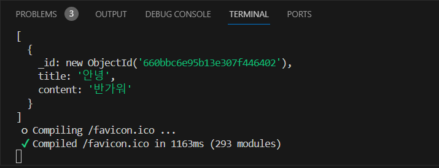

## State의 변경

> ✅ state를 변경시키려면 스프레드 연산자를 사용하여 값을 복사한 후, 복사본의 값을 변경시켜야 한다.

이는 리액트의 불변성과 관련있는데, 리액트는 기존 state와 새 state의 값을 비교하여 다를 경우에만 상태 변화를 감지한다. 불변성을 지켜줌으로써 효율적인 상태 업데이트를 하는 것이다. 때문에 상태를 직접 수정하기보다 복사본을 만들고 이 값을 변경해주는 것이 바람직한데, 여기서 또 주의할 점이 있다.

```javascript
let [ count, setCount ] = useState(0);

let newCount = state       # -> (x)
let newCount = [...count]  # -> (o)
```

위 예시 코드의 세 번째 줄과 같이 작성할 경우, 데이터의 값을 복사하는 것이 아니라 값의 주소를 복사하는 것과 같다. 따라서 값을 변경시켜도 기존 state와 새 state와의 값이 같기에 상태 변화를 감지하지 못하게 된다.<br />
반면, spread 연산자(`...`)를 사용하면 기존 state에 대해 완전히 독립적인 복사본을 만들어주어 값을 변경하면 변경한 값으로 상태가 업데이트되는 것이다.<br /><br />
<br />
이 부분은 사실상 리액트의 기초 원리에 해당하는 개념인데, 중요한 내용이라 한 번 더 짚고 넘어간다는 생각으로 정리해보았다.<br />
<br />
이제 이번 강의의 핵심 내용인 Next.js에서의 MongoDB 사용법으로 넘어도록하자.<br />
<br />
<br />

## Next.js에서 MongoDB 사용하기

### MongoDB란?

> 크로스 플랫폼 document 지향 데이터베이스 시스템

- 대표적인 비관계형 데이터베이스 중 하나로, 테이블과 행으로 데이터를 저장하는 관계형 데이터베이스와 달리 문서(document)를 통해 유연하게 처리하고 저장한다.
  - Collection과 Document 단위로 데이터를 저장하는데, 다음과 같은 구조로 되어 있다.
    
- NoSQL
- 대용량 분산 트래픽에 유리
  <br />
  <br />

강의에서는 MongoDB를 로컬에 설치하지 않고 클라우드에서 무료버전으로 호스팅 받아 사용하였는데, Atlas 사용법에 대해서도 아주 간략하게만 살펴보자.


- Database Access : DB접속용 아이디 비번 만드는 곳
- Network Access : DB접속이 가능한 IP를 설정하는 곳
- Collections : 저장된 데이터 확인하는 곳
  <br />

이 정도로만 일단 알아두면 될 것 같다.
<br />

### 1. 셋팅하기

```
npm install mongodb
```

터미널에 명령어를 입력하여 관련 라이브러리를 설치해준다.
<br />

### 2. DB 접속하기

```javascript
const client = await MongoClient.connect("DB접속url~~", {
  useNewUrlParser: true,
});
const db = client.db("forum");
```

이 코드만 넣어주면 DB 연결은 끝난건데, 이렇게 하면 해당 페이지를 새로고침 할 때마다 코드가 실행된다. DB connect는 여러번 실행하면 부담이 크기 때문에 next 서버를 띄울 때에 최초 한 번만 실행시켜주자.<br />
<br />
프로젝트 디렉토리 내에 utils 폴더를 만들어주고, 다음 코드를 복붙해준다.

```javascript
import { MongoClient } from "mongodb";

const url = "DB접속url~~";
const options = { useNewUrlParser: true };
let connectDB;

if (process.env.NODE_ENV === "development") {
  if (!global._mongo) {
    global._mongo = new MongoClient(url, options).connect();
  }
  connectDB = global._mongo;
} else {
  connectDB = new MongoClient(url, options).connect();
}
export { connectDB };
```

url의 아이디/비밀번호 부분엔 DB 접속용 아이디와 비밀번호를 입력해주면 된다.<br />
코드를 대충 해석하자면 원래 Next.js는 개발하는 동안에 파일을 저장하면 모든 JS 코드를 전부 다시 읽는 특성이 있는데, 그걸 방지하기 위해 첫 번째 if문 분기에서와 같이 global 변수를 만들어서 DB 연결을 재사용할 수 있도록 처리한 것이다.<br/>
<br/>

```javascript
import { connectDB } from "@/utils/database";

export default async function List() {
  const client = await connectDB;
  const db = client.db("forum");
  let posts = await db.collection("post").find().toArray();
  console.log(posts[0].title);

  // ...
}
```

이처럼 DB 연결을 하고 싶은 곳에 export한 변수를 가져와서 사용하면 된다.
<br/>

### 3. 데이터 조회

```javascript
db.collection("post").find();
```

post라는 이름의 collection에 저장된 데이터들(document)을 모두 조회하겠다는 의미이다. 실행해보면 다음과 같이 잘 뜬다.


> ✅ DB 데이터의 입출력 코드는 server component 안에서만 사용한다.<br />
> -> client component 안에서의 모든 코드는 유저 브라우저로 전달되기 때문!
