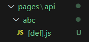

# 게시물 삭제 기능 구현하기

4주차에 수정 기능까지 만들어보았으니 이제 삭제 기능을 구현할 차례이다. <br/>

1. 게시물 리스트에서 각 게시물마다 삭제 버튼을 만들어야 하는데, 그걸 위해 list/page.js 파일을 통째로 클라이언트 컴포넌트로 만들어버리면 효율성이 떨어지기에, 게시물 목록만 우선 따로 분리해서 클라이언트 컴포넌트로 만들어준다. <br/>
2. 컴포넌트를 분리했으면 ListItem에 DB에서 받아온 데이터를 props로 넘겨준다. 이때, props 전달하는 방법 외에 ListItem 내에서 useEffect를 사용하여 DB의 데이터를 가져오는 방법도 있다. 하지만 useEffect 안의 코드는 html 로드가 완료된 후에 실행되기 때문에 검색엔진 노출에 불리하다는 단점이 있다. 따라서 컴포넌트 구조가 너무 복잡한 경우가 아니라면 첫번째 방법을 사용하는 것이 낫다.

<br/>

```javascript
// /app/list/ListItem.js

"use client";

export default function ListItem() {
  return (
    <div>
      {data.map((data) => (
        <div className="bg-white rounded-xl p-20 mb-5 shadow shadow-gray-300">
          <Link
            href={`/detail/${data._id}`}
            className="text-[18px] font-bold m-0 text-black no-underline"
          >
            {data.title}
          </Link>
          {/* <DetailLink */}
          <Link href={`/modify/${data._id}`}>
            <button className="bg-white border-none cursor-pointer">
              &nbsp;✏
            </button>
          </Link>
          <p className="text-[14px] text-gray-400 mx-0 my-1.5">
            {data.content}
          </p>
        </div>
      ))}
    </div>
  );
}
```

```javascript
// /app/list/page.js

import { connectDB } from "@/utils/database";
import ListItem from "./ListItem";

export default async function List() {
  const client = await connectDB;
  const db = client.db("forum");
  let data = await db.collection("post").find().toArray();
  console.log(data);

  return (
    <div className="bg-gray-50 p-10">
      <ListItem data={data} />
    </div>
  );
}
```

<br/>

> ✅ 큰 페이지는 서버 컴포넌트로 두고, JS 기능 넣을 부분만 클라이언트 컴포넌트로 만들어 서버 컴포넌트에서 import해와서 사용하는 것이 효율적인 방법임을 기억하자

<br/>

> ✅ 검색 노출이 중요한 페이지를 만들 때는 클라이언트 컴포넌트로 만들어 DB 데이터를 가져오기보다, 부모인 서버 컴포넌트에서 가져와 클라이언트 컴포넌트로 props를 전달하는 방식을 사용하는 것이 좋다

<br/>

## 서버에 요청 보내는 방식

이제 ListItem에 게시물 삭제 버튼을 만들고, 버튼을 클릭했을 때의 이벤트로 서버에 해당 게시물 삭제를 요청하는 기능을 구현해보자. <br/>

이전 강의에서는 `<form>` 태그를 사용해서 서버에 GET 또는 POST 요청을 보내는 방식을 배웠는데, 이 방식 외에 Ajax를 사용하는 방법도 있다.

### Ajax를 사용하여 서버에 요청 보내기

javascript의 fetch() 함수를 사용해서 서버에 GET, POST, PUT, DELETE 요청을 보낼 수 있다. form 태그 사용 시와 달리 새로고침 없이도 요청을 보낼 수 있다는 장점이 있다. <br/>
기본 형식은 다음과 같다.<br/>

```javascript
<button onClick={()=>{
  fetch('/URL', { method : 'POST', body : '안녕' })
}}>🗑️</button>
>
```

<br/>

MongoDB에서 데이터를 삭제할 때는 `deleteOne()`을 사용하면 되는데, 어떤 게시물을 삭제하면 되는지 알려주기 위해 게시물 id를 요청 시 같이 전달해주어야 한다.

```javascript
<span
  onClick={(e) => {
    fetch("/api/post/delete", {
      method: "DELETE",
      body: JSON.stringify({ _id: data._id.toString() }),
    });
  }}
>
  🗑️
</span>
```

```javascript
import { connectDB } from "@/utils/database";
import { ObjectId } from "mongodb";

export default async function handler(request, response) {
  console.log(request.body);
  if (request.method == "DELETE") {
    try {
      const db = (await connectDB).db("forum");
      const filter = { _id: new ObjectId(JSON.parse(request.body)._id) };
      const data = await db.collection("post").deleteOne(filter);
      return response.status(200).json(data + "삭제 완료");
    } catch (error) {
      return response.status(500).json("삭제 실패");
    }
  }
}
```
<br/>

> ✅ 이와 같이 게시물에 대한 정보를 request body에 담아서 전송하는데,서버에 Object나 array를 보낼 때는 `JSON.stringify()`를 사용해야 한다는 점을 유의하자.

서버와 데이터를 주고 받을 때는 문자 또는 숫자만 가능하기 때문인데, 이 경우에도 ObjectID형을 보내고 있기 때문이다. 추가로, 해당 메소드 사용 시 예를 들어 원래 object가 { \_id: 123 } 이었다고 할 때, JSON.stringify({ \_id: 123 })는

`{ "_id": 123 }`

이와 같이 JSON 형식으로 변환된다. 따라서, . 연산자를 사용하여 객체의 값에 접근하는 것이 불가능해진다. <br/>
고로 서버에 전달될 때 JSON형으로 바꿨던 데이터를 서버에서 요청을 받아 처리 할 때 다시 Object형으로 바꿔주어야 하는데, 이는 `JSON.parse()`를 사용하면 된다.

<br/>

### query string을 사용하여 서버에 요청 보내기

```javascript
fetch("/api/test?name=kim&age=20");
```

query string을 사용하면 url에 예시와 같이 작성만 해줘도 {name: kim, age: 20}이라는 데이터를 전송할 수 있다. <br/>
간단하고 GET 요청이 가능하다는 장점이 있다.(원래 GET method는 request에 body를 같이 보낼 수 없다) 하지만 데이터가 많으면 더러워질 수 있고, url에 정보가 노출되기 때문에 민감한 정보는 담지 않는 것이 좋다는 점을 유의해야 할 것 같다.

<br/>

### URL parameter를 사용하여 서버에 요청 보내기



```javascript
fetch("/api/abc/def");
```

위와 같이 디렉토리 구조를 설정했을 때, 요청을 보내는 경로가 /api/abc/1이든 /api/abc/2이든 [def].js 안의 코드가 실행된다. ([] -> 아무문자) <br/>서버에서는 URL parameter에 오는 문자를 `request.query`를 사용하여 출력할 수 있다.
