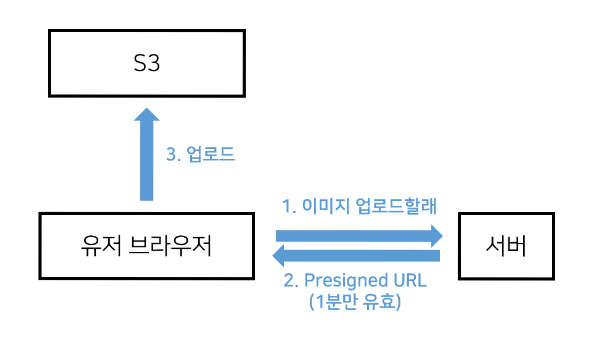

## Vercel로 Next.js 앱 배포하기

### Vercel

AWS Lambda 기반의 FaaS 플랫폼

- 서버리스 <br/>
잠시 서버리스에 관련해 간단하게 알아보고 가자. <br/>
  서버리스 아키텍처의 대표적인 구현 방식으로는 FaaS(Function as a Service)와 BaaS(Backend as a Service)가 있고, 그 중에서도 일반적으로 서버리스 아키텍처하면 FaaS를 가리킨다. <br/>
  말그대로 함수로 서비스를 제공하며, 업로드된 코드는 평소에는 함수 단위로 쪼개어 대기상태에 두다가 요청이 들어오면 함수를 실행시키는 방식이다. <br/>
  서버, 운영체제, 런타임 등의 인프라를 직접 관리하지 않아도 되며, 함수가 실행된 정도만큼 비용을 지불하기 때문에 트래픽이 변동하는 웹 어플리케이션에 적합하게 사용할 수 있다는 장점이 있다.<br/>

이 FaaS의 대표적인 예로 AWS Lambda, Google Cloud Functions 등이 있는데, Vercel이 이 중 AWS Lambda를 기반으로 한 것이다.<br/><br/>
Vercel은 Next.js에서 공식적으로 제공하는 호스팅 사이트로서, 빌드+배포+호스팅을 간편하게 할 수 있어 지금까지 만든 forum app을 이 Vercel을 이용해 배포해보려 한다. <br/>

vercel.com에 들어가보기만 해도 아주 쉽게 튜토리얼을 따라 배포할 수 있기 때문에 방법은 생략하도록 하겠다.<br/>
<br/><br/>

## AWS S3를 사용한 이미지 업로드

일반적으로 이미지는 저장은 DB보다 하드디스크에 하는 것이 나은데, 사이트를 클라우트 서비스를 사용해 호스팅 중인 경우, 하드디스크 사용이 불편해지기 때문에, 이 또한 클라우드 서비스에서 빌려 사용하는 것이 편리하다. 대표적으로 AWS에서 제공하는 S3가 있는데, 오늘은 이걸 사용해볼 예정이다.

### AWS S3

파일 저장용 스토리지(하드디스크)를 빌려주는 서비스
<br/>

- S3 버킷 : 하나의 하드디스크

<br/>

```javascript
export default function Write() {
  return (
    <div>
      <h4>글 작성</h4>
      <form action="/api/post/new" method="post">
        <input type="text" name="title" placeholder="제목 입력" />
        <input type="text" name="content" placeholder="내용 입력" />
        <input type="file" accept="image/*" />
        
        <button type="submit">발행</button>
      </form>
    </div>
  );
}
```

이와 같이 이미지 파일을 업로드할 수 있도록 input 태그를 추가해준다. 그리고 img 태그를 통해 선택한 이미지를 보여주는데, 이 때 `createObjextURL`을 사용하는 방법, 또는 선택한 이미지를 S3에 바로 업로드 시키는 방법을 사용할 수 있다. <br/>

### Presigned URL <br/>

보통은 두 번째 방법을 사용하는 것이 간단한데, 유저가 업로드할 이미지를 선택하면 그 이미지가 S3에 바로 업로드가 되기 때문에 업로드 이후 해당 이미지의 url만 src 속성에 넣어주면 되기 때문이다. 이전과 달리 이렇게 서버를 거치지 않고 S3에 직접 업로드하는 방식을 Presigned URL이라고 한다. <br/>



> 1. `<input>`에서 사용자가 이미지를 선택하는 순간 서버에 GET 요청을 전송
> 2. 서버에서 사용자 검증 후 Presigned URL을 만들어 사용자의 브라우저로 전달
> 3. 사용자는 브라우저에서 Presigned URL을 이용하여 S3로 POST 요청을 보내 이미지를 업로드
> 4. 업로드 성공 시 해당 이미지의 URL을 `` 태그의 src 속성 안에 넣고, 업로드된 이미지를 렌더링

<br />

```javascript
<input
  type="file"
  accept="image/*"
  onChange={async (e) => {
    let file = e.target.files[0];
    let filename = encodeURIComponent(file.name);
    let res = await fetch(`/api/post/image?file=${filename}`);
    res = await res.json();
    console.log(res);

    //S3 업로드
    const formData = new FormData();
    Object.entries({ ...res.fields, file }).forEach(([key, value]) => {
      formData.append(key, value);
    });
    let result = await fetch(res.url, {
      method: "POST",
      body: formData,
    });
    console.log(result);

    if (result.ok) {
      setSrc(result.url + "/" + filename);
    } else {
      console.log("업로드 실패");
    }
  }}
/>

```

```javascript
import aws from "aws-sdk"; // 서버에서 aws 기능들을 사용할 수 있도록 도와주는 라이브러리

export default async function handler(request, response) {
  aws.config.update({
    accessKeyId: process.env.ACCESS_KEY,
    secretAccessKey: process.env.SECRET_KEY,
    region: "ap-northeast-2",
    signatureVersion: "v4",
  });

  const s3 = new aws.S3();
  const url = await s3.createPresignedPost({
    // Presigned URL을 발급해줌
    Bucket: process.env.BUCKET_NAME,
    Fields: { key: request.query.file }, // 업로드할 파일명
    Expires: 60, // seconds
    Conditions: [
      ["content-length-range", 0, 1048576], //파일용량 1MB 까지 제한
    ],
  });

  response.status(200).json(url);
}
```
<br/>

### createObjectURL
현재는 이미지를 선택함과 동시에 업로드를 하고 있는데, 만일 유저가 이미지를 선택해놓고 글 발행 버튼을 누르지 않는다면 S3의 용량이 낭비되게 된다. <br/> 이 경우, createObjectURL를 사용해 이미지 미리보기를 구현하여 해결할 수 있을 것으로 보인다. 큰 이미지 파일을 다룰 경우 메모리 사용량 측면에서 효과적이지 않은 방법이기에 Presigned URL 방식을 첫번째로 소개하였는데, `createObjectURL`를 사용하면 아주 간단하게 이미지를 미리보기 할 수 있다는 장점이 있다. <br/>
> ✅ 선택한 이미지 파일을 Blob 객체로 변환 -> 해당 객체를 URL로 변환 -> 미리보기 이미지 

<br/>

```javascript
const ImageUploadPreview = () => {
  const [image, setImage] = useState('');

  const handleImageChange = (e) => {
    const file = e.target.files?.[0];
    if (file) {
      const imgUrl = URL.createObjectURL(file);
      setImage(imgUrl);
    }
  };

  return (
    <div>
      <input type="file" accept="image/*" onChange={handleImageChange} />
      {image && }
    </div>
  );
};
```